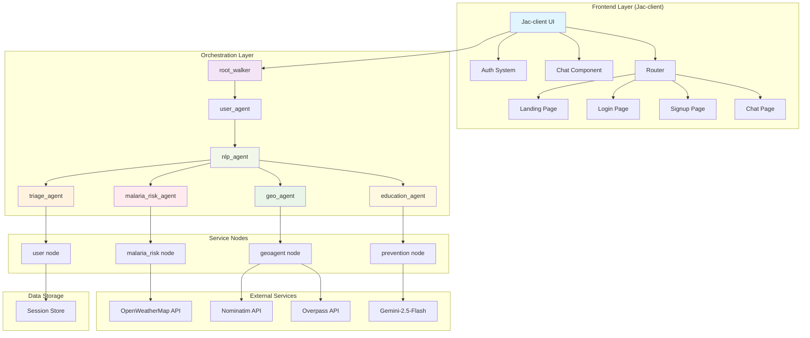

# MalariaPredict AI 🦟

## Overview
MalariaPredict AI is a bilingual (English/Kiswahili) AI-powered system for malaria symptom assessment, risk prediction, hospital location, and prevention education. Built with Jaseci, it combines conversational AI with real-time data from weather APIs and geolocation services to provide personalized malaria health guidance.

## Features

### 🏥 **Core Capabilities**
- **Bilingual Symptom Triage**: Interactive 5-question assessment in English/Kiswahili
- **Malaria Risk Prediction**: 30-day forecast based on weather data (temperature, humidity, rainfall)
- **Hospital Finder**: Locates nearest medical facilities with Google Maps directions
- **Prevention Education**: AI-generated prevention tips tailored to local context
- **Session Management**: Persistent user sessions with conversation history

### 🔧 **Technical Features**
- Multi-LLM support (Gemini 2.0 Flash, GPT-4o, Llama 3)
- Real-time geocoding with OpenStreetMap/Nominatim
- Weather data integration via OpenWeatherMap
- Jac-client frontend (Jaseci-based React framework)
- Stateful conversation management


Caption: The MalariaPredict AI landing page with hero section, features grid, and statistics bar.

## Architecture



## Installation & Setup

### Prerequisites
- Python 3.10+
- Jaseci Core
- Jac-client for frontend
- API Keys:
  - OpenWeatherMap API key
  - Gemini API key (or other LLM provider)

### 1. Clone and Initialize
```bash
git clone <repository-url>
cd app.jac
pip install -r requirements.txt
```

### 2. Environment Configuration
Create `.env` file:
```env
GEMINI_API_KEY=your_gemini_api_key_here
OPENWEATHER_API_KEY=your_openweather_api_key_here
```


## Usage Flow

### 1. **Initialization**
```
User → root_walker → user_agent (creates session) → nlp_agent
```

### 2. **Language Selection**
- Choose between Kiswahili (1) or English (2)

### 3. **Main Menu Options**
```
1. Symptom Assessment (triage_agent)
2. Malaria Risk Check (malaria_risk_agent)
3. Find Nearest Hospital (geo_agent)
4. Prevention Tips (education_agent)
5. Exit
```

### 4. **Symptom Triage Process**
1. Fever/chills assessment
2. Headache check
3. Nausea/vomiting evaluation
4. Fatigue/joint pain assessment
5. Risk classification:
   - Very High → Immediate hospital referral
   - High → Urgent testing recommendation
   - Medium → Testing within 24 hours
   - Low → Prevention guidance

### 5. **Risk Prediction**
- Uses 30-day weather forecast
- Calculates probability based on:
  - Temperature (16-34°C optimal for mosquitoes)
  - Rainfall (15-150mm optimal)
  - Humidity (>60% optimal)

### 6. **Hospital Finder**
- Geocodes user location
- Queries Overpass API for hospitals/clinics
- Returns top 5 nearest facilities with Google Maps links

## Code Structure

```
app.jac
├── IMPORTS & CONFIGURATION
│   ├── LLM model selection (Gemini/GPT-4o/Llama)
│   └── Session storage initialization
├── NODE DEFINITIONS
│   ├── user: Session management
│   ├── prevention: Tip generation via LLM
│   ├── geoagent: Hospital location services
│   └── malaria_risk: Weather-based prediction
├── WALKER DEFINITIONS
│   ├── user_agent: Session routing
│   ├── nlp_agent: Language & menu handling
│   ├── triage_agent: Symptom assessment
│   ├── education_agent: Prevention tips
│   ├── geo_agent: Hospital search
│   ├── malaria_risk_agent: Risk computation
│   └── root_walker: Entry point
└── JAC-CLIENT FRONTEND
    ├── Navigation Component
    ├── Landing Page (Button-Free Design)
    ├── Authentication (Login/Signup)
    ├── Chat Interface with Message Bubbles
    └── Router with Protected Routes
```

## API Integrations

### 1. **OpenWeatherMap API**
- Endpoint: `pro.openweathermap.org/data/2.5/forecast/climate`
- Purpose: 30-day climate forecast for malaria risk calculation
- Parameters: Location, API key, metric units

### 2. **Nominatim API**
- Endpoint: `nominatim.openstreetmap.org/search`
- Purpose: Convert location names to coordinates
- Rate limiting: Requires User-Agent header

### 3. **Overpass API**
- Endpoint: `overpass.kumi.systems/api/interpreter`
- Purpose: Find hospitals/clinics near coordinates
- Query: Searches 10km radius for medical facilities

### 4. **LLM Providers**
- Primary: Gemini 2.5 Flash via LiteLLM
- Usage: Prevention tip generation, conversational responses

## Configuration

### Model Selection
```python
glob llm = Model(model_name="gemini/gemini-2.5-flash", verbose=True);

```

### Risk Calculation Parameters
```python
# Optimal ranges for malaria transmission:
temp_range = (20.0, 30.0)    # Celsius
rain_range = (15.0, 150.0)   # mm/month
humidity_min = 60.0          # Percentage
```


### Integration Tests
1. Full conversation flow
2. API connectivity checks
3. Session persistence validation
4. Bilingual response verification

## Error Handling

### Common Issues
1. **API Rate Limiting**: Exponential backoff for weather/geocoding APIs
2. **Location Not Found**: Fallback to nearest major city
3. **LLM Timeouts**: Model switching with fallback chain
4. **Session Expiry**: Automatic session renewal with history preservation


## Jac-client Frontend Features

### Authentication System
- Jaseci-based login/signup with `jacLogin`, `jacSignup`, `jacLogout`
- Protected routes using `jacIsLoggedIn`
- Session management across browser refreshes

### UI Components
- **Navigation Bar**: Responsive header with login/logout
- **Landing Page**: Engaging hero section with statistics and features grid
- **Chat Interface**: Message bubbles with proper formatting for bot/user messages
- **Form Components**: Styled login/signup forms with validation

### Routing
- `/` - Landing page (public)
- `/login` - Login page
- `/signup` - Signup page
- `/chat` - Main chat interface (protected)

## Contributing

### Development Workflow
1. Fork repository
2. Create feature branch
3. Add tests for new functionality
4. Ensure all tests pass
5. Submit pull request

### Code Standards
- Follow Jac language conventions
- Include docstrings for all nodes/walkers
- Maintain bilingual support for all user-facing text
- Use descriptive variable names

## License

This project is licensed under the MIT License - see the LICENSE file for details.

## Acknowledgments

- **Jaseci Community** for the framework and Jac-client
- **OpenStreetMap** for geodata
- **OpenWeatherMap** for climate data
- **Google** for Gemini AI capabilities

## Support

For issues, questions, or contributions:
1. Check existing GitHub issues
2. Review Jaseci documentation
3. Contact: teretich92@gmail.com

---

**Motto**: *Know sooner. Act faster. End malaria together.*
